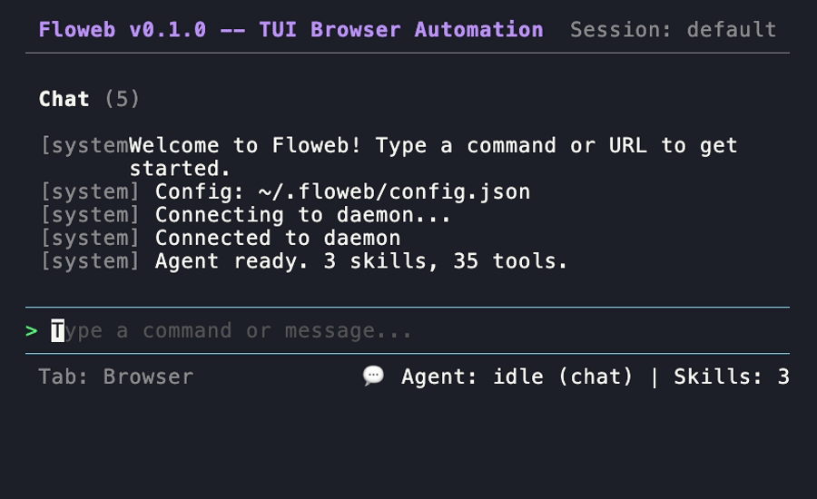

# floweb

基于终端的浏览器自动化工具，内置 LLM 驱动的 Agent —— 用自然语言操控浏览器，自动生成 Playwright 脚本。


## Demo



## 界面


*Chat Panel：自然语言交互，agent 操控浏览器并返回结果*


*Browser Panel：snapshot 视图，agent 看到的页面结构*


## 安装

```bash
npm install -g floweb
# 或者本地开发
git clone git@github.com:chaomitang/floweb-agent.git
cd floweb-agent
pnpm install && pnpm build
```

## 快速开始

```bash
floweb tui                    # 启动对话式 TUI
```

在 TUI 中：

```text
/open github.com              # 让 agent 打开页面
Summarize this page           # 自然语言交互
Click the first link          # 让 agent 操作页面
/pages                        # slash 命令：查看所有标签页
```

也可以直接用 CLI：

```bash
floweb session start mybot https://example.com
floweb open https://example.com
floweb snapshot --session mybot
floweb session stop mybot
```

或 MCP 模式接入三方 Agent（Claude Code 等）：

```bash
floweb mcp
```

## 工作流

```text
Explore（探索）→ Spec（规格）→ Validate（验证）→ Script（脚本）
```

1. **Explore** — 自然语言指挥 agent 浏览页面、点击、填表
2. **Spec** — 将操作过程固化为可复用的规格文件
3. **Validate** — 回放验证 spec 是否仍然正确
4. **Script** — 导出独立 Playwright 脚本，可直接部署

## 架构

```text
                    ┌──────────────────────────────┐
                    │       DaemonApi (30+ IPC)     │
                    │  统一的浏览器操作接口          │
                    └──────────┬───────────────────┘
                               │ Unix socket
            ┌──────────────────┼──────────────────┐
            ▼                  ▼                  ▼
     ┌──────────┐      ┌──────────┐       ┌──────────┐
     │   CLI    │      │   MCP    │       │   TUI    │
     │ 子命令   │      │  tools   │       │  Agent   │
     └──────────┘      └──────────┘       └──────────┘
                               ▼
                    ┌──────────────────┐
                    │   BrowserManager │
                    │   (Playwright)   │
                    └──────────────────┘
```

CLI、MCP、TUI 三种接入方式能力完全对等，底层走同一个 DaemonApi。

## Skills 系统

三种 skill 覆盖不同接入场景：

| Skill | 适用场景 | 调用方式 |
|---|---|---|
| `floweb` | TUI 内置 LangGraph Agent | 直接调用 35 个工具 |
| `floweb-cli` | 三方 Agent（Claude Code 等） | `floweb <subcommand>` CLI |
| `floweb-mcp` | 三方 Agent（Claude Code 等） | `browser_*` MCP tools |

## 配置

首次运行自动创建 `~/.floweb/config.json`：

```json
{
  "llm": {
    "provider": "openai",
    "model": "deepseek-v4-pro",
    "apiKey": "",
    "baseUrl": "https://api.deepseek.com/v1"
  }
}
```

## License

MIT
