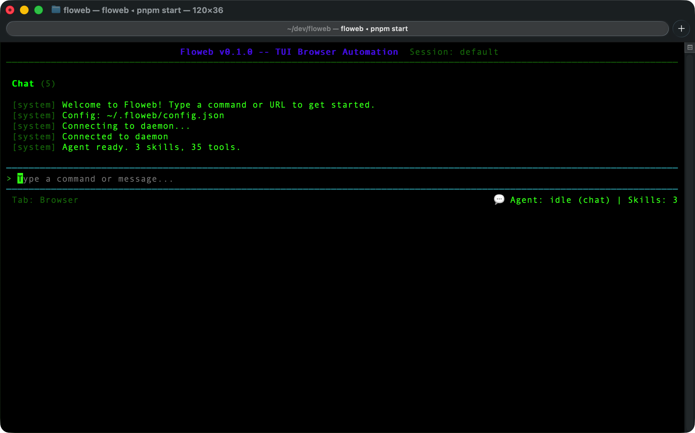
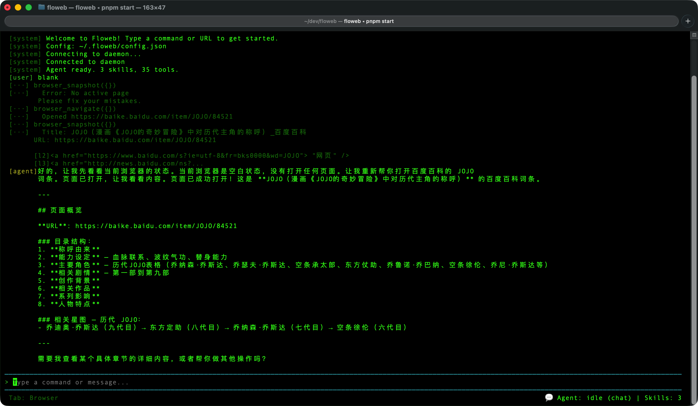
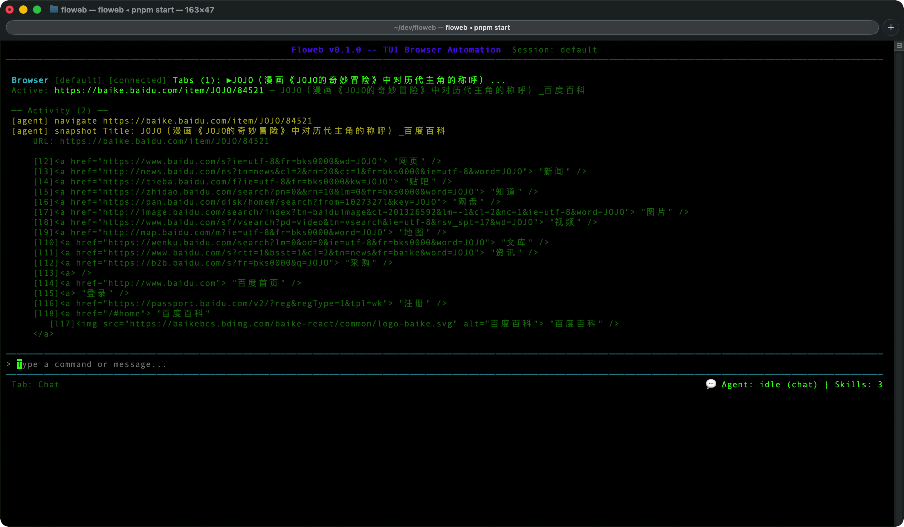

# Floweb：用自然语言操控浏览器，自动生成 RPA 脚本

> 一句话：在终端里跟 AI 聊天，指挥它操作浏览器，最后导出可复用的 Playwright 脚本。



## 是什么

Floweb 是一个浏览器自动化工具，帮助人开发 RPA 脚本。本质上，它是 **Agent 和 Web 自动化的结合实验** —— 让 LLM 直接操控浏览器，将对话过程固化为可复用的 Playwright 脚本。

LLM 能对话式地操作浏览器，但有两个天然缺口：

1. **对话成果无法沉淀**。LLM 一步步操作浏览器，做完了就完了。下次要跑同样的流程，还得再指挥一遍。对话不能直接变成可复用的脚本。

2. **自动化和人工需要交替**。登录验证码、反爬滑块、手机验证 —— LLM 不可能自动完成这些。实用的 RPA 工具必须允许人工随时介入，而不能指望全自动。

所以 Floweb 的设计思路是：**对话式探索 → 固化为 Spec → 导出独立脚本**，过程中人可以在浏览器里直接接手操作，LLM 在边上观察学习。

## 架构：三种接入，一条管道

```text
┌──────────────────────────────────────────────────┐
│                  Daemon (守护进程)                  │
│  ┌─────────────┐  ┌──────────┐  ┌─────────────┐  │
│  │BrowserManager│  │ Snapshot │  │ Checkpoint   │  │
│  │ (Playwright) │  │ (CDP)    │  │ (Phase 缓存) │  │
│  └─────────────┘  └──────────┘  └─────────────┘  │
│                      │                            │
│              Unix Domain Socket                    │
│              (JSON-line 协议)                      │
└──────────────────────┬───────────────────────────┘
                       │
          ┌────────────┼────────────┐
          ▼            ▼            ▼
     ┌─────────┐ ┌─────────┐ ┌──────────┐
     │   TUI   │ │   CLI   │ │   MCP    │
     │ React   │ │commander│ │ JSON-RPC │
     │ + Ink   │ │ 30 子命令│ │stdin/stdout│
     │+LangGraph│ │         │ │          │
     └─────────┘ └─────────┘ └──────────┘
     (内置Agent)  (shell脚本)  (Claude Code等)
```

### 守护进程（Daemon）

整个系统的核心是一个独立的 Node.js 子进程。启动时通过 `child_process.fork()` 创建，管理 Playwright Chromium 实例的生命周期。每个命名 session 有自己独立的 socket 文件（`/tmp/floweb-${uid}-<name>.sock`），实现多 session 隔离。

Daemon 内部三个核心模块：

- **BrowserManager**：Playwright 封装，管理 page/context/browser 生命周期，所有操作默认 10s timeout。操作通过 CDP（Chrome DevTools Protocol）直接和浏览器通信。
- **Snapshot 系统**：通过 CDP 并行调用 `Accessibility.getFullAXTree` 和 `DOM.getDocument`，融合 Accessibility Tree 和 DOM Tree 两棵树的优势，给每个交互元素分配短引用 ID（`l1`、`l2`），渲染为 `[ref]<tag role="role"> "name"` 的紧凑格式。diff 基于节点指纹（role:name:value + DOM 路径），输出 `+新增 / -删除 / ~修改`。
- **Checkpoint 系统**：Spec 验证时每个 Phase 通过后保存 checkpoint，失败时从断点继续，不用重跑已通过的步骤。

### IPC 管道

客户端（TUI / CLI / MCP）和 Daemon 之间通过 **Unix Domain Socket + JSON-line 协议**通信。每个请求是一个 JSON 对象，包含方法名和参数；每个响应也是一个 JSON 对象。

这套管道之上定义了两个方向的接口：

- **DaemonApi**（50+ 方法）：客户端调用 daemon（navigate、click、snapshot、exec...）
- **ClientApi**（4 个事件）：daemon 推送给客户端（pagesChanged、sessionStatusChanged、actionLogged、observingChanged）

### 观察模式的数据流

用户手动操作浏览器时，BrowserManager 通过 `exposeBinding` 注入 `__floweb_log` 函数，捕获用户在浏览器中的点击和输入事件。这些事件通过 `ClientApi.actionLogged` 推送给所有客户端。TUI 收到后自动进入观察模式（边框变黄），并通过 snapshot diff 实时反馈页面变化给 agent。

### 三条接入路径

三种接入方式共享同一套 DaemonApi，底层完全相同，只是上层协议不同：

| 方式 | 协议 | Agent 位置 | 适用场景 |
| --- | --- | --- | --- |
| TUI | 直连 Socket | 内置 LangGraph Agent | 交互式开发、对话探索 |
| CLI | 直连 Socket | 无（纯命令） | Shell 脚本、CI/CD |
| MCP | JSON-RPC stdin/stdout | 外部（Claude Code 等） | 接入三方 Agent 生态 |

## 对话与观察：两种模式的丝滑切换

Floweb 最核心的交互设计不是「人指挥 AI 干活」的单向模式，而是**对话探索（Agent 操作）和观察学习（用户操作）的实时交融**。

### 对话模式：Agent 操控浏览器

用户用自然语言描述意图，agent 调用 `browser_click`、`browser_type`、`browser_scroll` 等工具直接操作浏览器。每步操作后自动返回页面变化的 diff，agent 根据变化决定下一步。用户在终端里看着 agent 操作，可以随时插话纠正方向。

### 观察模式：用户操作，Agent 旁观学习

用户直接在 Playwright 浏览器窗口里手动操作时，agent 自动检测到用户行为（点击、输入、导航），无缝切换到观察模式：

- 浏览器边框从粉色变为黄色，提示当前处于观察模式
- agent 实时分析并反馈：*「你点击了登录按钮」「页面跳转到了 dashboard」*
- 用户不需要说「进入观察模式」「退出观察模式」—— agent 根据用户行为自动判断

### 模式切换由对话驱动，不用死记命令

```text
User:  帮我登录后台
Agent: 打开登录页，填写了用户名，发现需要验证码。
      调 browser_ask_human({ message: "请帮我完成验证码" })

【Agent 自动进入观察模式，边框变黄】

User:  直接在浏览器里点验证码、输入、点登录

Agent: 看到你完成了验证码，登录成功，页面跳转到了后台首页。
       已退出观察模式。需要我继续操作吗？

User:  帮我导出今天的订单报表
Agent: 好的，让我找到导出按钮...（切回对话模式，继续自动化）
```

整个过程没有显式的「切换模式」命令，用户就是在对话和操作之间自然地流动。Agent 在被需要时主动工作，在遇到障碍时主动把控制权交给人，人在浏览器里接手的每一步都被 agent 观察和理解，最终沉淀为 spec 中的自动化步骤。

这种设计来自 RPA 开发的真实经验：**自动化和人工不是对立的，它们应该能在同一条时间线上无缝接力**。

## 核心工作流：Explore → Spec → Validate → Script

### 1. Explore（探索）

在 TUI 中跟 agent 自然对话，指挥浏览器操作：

```text
/open apple.com.cn               → 打开页面
看看最新的 MacBook Air 规格       → agent 自动导航、点击、滚动
请把规格数据整理成表格             → agent 提取结构化数据
```

内置的 **快照系统** 通过 CDP 并行拉取 Accessibility Tree + DOM Tree，把页面变成结构化的交互元素列表（`[l1] button "登录"`、`[l2] input "用户名"`），agent 看到的就是这个视图，不需要处理原始 HTML。



### 2. Spec（规格）

操作完成后，一句「整理成 spec」，agent 把刚才的操作过程固化为 Markdown 规格文件。以抓取 Apple MacBook Air 技术规格为例，agent 生成如下 spec：

```markdown
## Phase 1: 打开 Apple 中国官网
- [ ] 导航到 apple.com.cn
- [ ] 确认页面加载成功，标题包含 "Apple (中国大陆)"

**Actions:**
  browser_navigate → https://www.apple.com.cn

**Asserts:**
  page.url().includes('apple.com.cn') → 成功导航到 Apple 中国官网
  await page.title().then(t => t.includes('Apple')) → 页面标题包含 Apple
```

```markdown
## Phase 4: 进入技术规格页面
- [ ] 点击 "技术规格" 导航链接
- [ ] 确认进入技术规格页面

**Actions:**
  browser_click → a[href="/macbook-air/specs/"]

**Asserts:**
  page.url().includes('/specs') → 当前页面为技术规格页
  await page.locator('h1').textContent().then(t => t.includes('技术规格')) → 页面标题包含"技术规格"
```

Spec 是人可读的文档，但机器也能执行。每个 Phase 包含明确的 Actions（做什么）和 Asserts（怎么验证），借鉴了 E2E 测试的设计思路。完整的 spec 共 6 个 Phase，覆盖从打开官网到提取规格数据的全流程：

**完整 spec 文件（`specs/apple-macbook-air-specs.md`）：**

```markdown
# Apple MacBook Air M5 技术规格抓取

从 Apple 中国官网抓取 MacBook Air 最新款的技术规格信息。

## Phase 1: 打开 Apple 中国官网

- [ ] 导航到 apple.com.cn 首页
- [ ] 确认页面加载成功，标题包含 "Apple (中国大陆)"

**Actions:**
- tool: browser_navigate
  args:
    url: https://www.apple.com.cn

**Asserts:**
- condition: page.url().includes('apple.com.cn')
  description: 成功导航到 Apple 中国官网
- condition: await page.title().then(t => t.includes('Apple'))
  description: 页面标题包含 Apple

## Phase 2: 进入 Mac 产品页面

- [ ] 点击导航栏中的 "Mac" 链接
- [ ] 确认进入 Mac 系列产品页面

**Actions:**
- tool: browser_click
  args:
    selector: a[href="/mac/"]

**Asserts:**
- condition: page.url().includes('/mac')
  description: 当前页面为 Mac 系列产品页

## Phase 3: 进入 MacBook Air 产品页

- [ ] 点击 MacBook Air 产品链接
- [ ] 确认进入 MacBook Air 概览页面

**Actions:**
- tool: browser_click
  args:
    selector: a[aria-label*="MacBook Air"]

**Asserts:**
- condition: page.url().includes('macbook-air')
  description: 当前页面为 MacBook Air 产品页

## Phase 4: 进入技术规格页面

- [ ] 点击 "技术规格" 导航链接
- [ ] 确认进入技术规格页面

**Actions:**
- tool: browser_click
  args:
    selector: a[href="/macbook-air/specs/"]

**Asserts:**
- condition: page.url().includes('/specs')
  description: 当前页面为技术规格页

## Phase 5: 查看 15 英寸规格

- [ ] 切换到 15 英寸标签页
- [ ] 确认 15 英寸标签页处于选中状态

**Actions:**
- tool: browser_click
  args:
    selector: button#table-15-label

**Asserts:**
- condition: await page.locator('button#table-15-label').getAttribute('aria-selected').then(v => v === 'true')
  description: 15 英寸标签页处于选中状态

## Phase 6: 提取核心规格数据

- [ ] 提取芯片型号（Apple M5）
- [ ] 提取三款机型价格（RMB 9,999 / 11,499 / 12,999）
- [ ] 提取显示屏参数（15.3" Liquid 视网膜, 2880×1864, 500nit）
- [ ] 提取电池续航（18 小时）
- [ ] 提取尺寸重量（1.15cm / 1.51kg）

**Actions:**
- tool: browser_exec
  args:
    code: |
      const data = await page.evaluate(() => {
        const main = document.querySelector('main');
        return main ? main.innerText.substring(0, 5000) : 'N/A';
      });
      console.log(data);

**Asserts:**
- condition: "true"
  description: 规格数据已提取（人工验证）
  stopOnFail: false
```



### 3. Validate（验证）

调用 `spec_mark_phase_complete`，agent 会按顺序执行每个 Phase 的 Actions，然后运行 Asserts 验证结果。全部通过自动标记为 `[x]`，失败则返回详细诊断（expected vs actual + URL + snapshot）。

验证失败时，你可以修复 spec 重新跑 —— 已通过的 Phase 有 checkpoint 缓存，直接从失败的 Phase 继续。

### 4. Script（脚本）

验证全部通过后，导出独立的 Playwright 脚本。以下是对应上述 spec 的真实产物：

```typescript
import { chromium } from "playwright";

type MacBookAirSpec = {
  chip: string;
  models: Array<{ memory: string; storage: string; price: string }>;
  display: string;
  battery: string;
  dimensions: string;
  weight: string;
  wireless: string;
  camera: string;
  colors: string[];
};

export default async function fetchMacBookAirSpecs() {
  const browser = await chromium.launch({ headless: false });
  const page = await browser.newPage();

  try {
    // Phase 1: 打开 Apple 中国官网
    await page.goto("https://www.apple.com.cn", { waitUntil: "domcontentloaded" });

    // Phase 2: 进入 Mac 产品页面
    await page.click('a[href="/mac/"]');
    await page.waitForURL("**/mac/**");

    // Phase 3: 进入 MacBook Air 产品概览页
    await page.click('a[aria-label="进一步了解，13 英寸和 15 英寸 MacBook Air"]');
    await page.waitForURL("**/macbook-air/**");

    // Phase 4: 进入技术规格页面
    await page.goto("https://www.apple.com.cn/macbook-air/specs/", {
      waitUntil: "domcontentloaded",
    });

    // Phase 5: 切换到 15 英寸标签页
    await page.click("button#table-15-label");
    await page.waitForTimeout(500);

    // Phase 6: 提取规格数据
    const rawText = await page.evaluate(() => {
      const main = document.querySelector("main");
      return main ? main.innerText : "";
    });

    return {
      url: page.url(),
      title: await page.title(),
      spec: parseSpec(rawText),
    };
  } finally {
    await browser.close();
  }
}

// 自执行入口，可直接 node 运行
const isMain = process.argv[1] === import.meta.url;
if (isMain) {
  fetchMacBookAirSpecs()
    .then(result => console.log(JSON.stringify(result.spec, null, 2)))
    .catch(err => { console.error("抓取失败:", err); process.exit(1); });
}
```

脚本不依赖 Floweb，不依赖 LLM，可以直接部署到 CI/CD 或定时任务中。从 spec 到脚本的映射是一一对应的：spec 里的每个 Phase 变成脚本里的一个步骤块，Actions 变成 Playwright API 调用，Asserts 变成类型定义和数据校验。

## Human-in-the-loop：当 LLM 遇到登录墙

这是做浏览器自动化最头疼的问题。Akamai、Cloudflare 的 JS Challenge、手机验证码、滑块验证 —— LLM 不可能自动绕过。

Floweb 的处理方式是 `browser_ask_human` 工具：

```text
Agent: 检测到登录页面，我搞不定。
       调用 browser_ask_human({ message: "请手动完成登录" })

【Agent 进入观察模式，暂停当前 turn】

User:  在浏览器窗口里直接输入账号密码，点击登录

User:  好了

Agent: 看到你完成了登录，跳转到了 dashboard。
       继续后续的自动化步骤...
```

关键设计：

- **密码不经过 agent/LLM**：用户直接在 Playwright 浏览器窗口里输入，agent 的返回内容里不会出现密码
- **不阻塞进程**：`browser_ask_human` 只是一个「标记 + 进入观察模式」，立即返回。LangGraph 的 ReAct 循环自然结束 turn，等用户下一轮消息继续。不需要死板的「按 Enter 确认」
- **观察模式**：用户操作时，agent 通过快照 diff 实时追踪页面变化，学习操作步骤

生成的脚本中，`browser_ask_human` 对应一个 `askHuman()` 辅助函数，保持人工检查点的语义。

## 技术选型

| 层 | 方案 | 原因 |
| --- | --- | --- |
| 浏览器驱动 | Playwright (Chromium) | CDP 协议丰富，快照系统需要 AX Tree + DOM 并行拉取 |
| Agent 编排 | LangGraph (ReAct) | 工具调用循环、检查点缓存、流式输出 |
| LLM 接口 | LangChain (Anthropic/OpenAI/DeepSeek) | 多 Provider 统一接口，支持 thinking mode |
| TUI | React 19 + Ink 7 | 终端原生 UI，组件化开发 |
| IPC | Unix Domain Socket + JSON-line | 进程间通信，低延迟 |
| 校验 | Zod 4 | 配置、CLI 参数、API schema 全链路校验 |
| 构建 | tsup + tsc-alias | ESM only，`@/` 路径别名 |

## 项目状态

- 35 个 Browser 工具 + 5 个 Spec 工具 + 2 个 Skill 工具
- 完整的 Session 管理（独立 daemon + 浏览器实例 + socket 隔离）
- 内置反爬审计（检测 Akamai/Cloudflare/DataDome/webdriver 指纹）
- 认证 Profile 持久化（cookies + localStorage）

## 后续计划

暂无，想到哪儿做哪儿。

---

*如果你也在做 AI + 浏览器自动化方向，欢迎一起讨论。*
